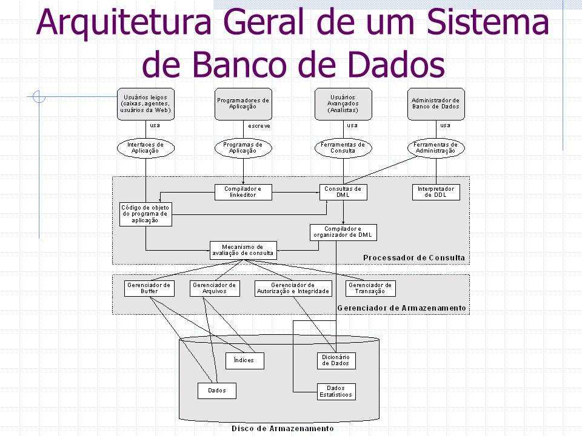

[← Pagina Inicial](../../README.md)

<h1 align="center">Sistemas Gerenciadores de Bancos de Dados (SGBD)<h1>

## O que é um SGBD?

Um sistema gerenciador de banco de dados é o encarregado de manter seus dados seguros, disponibilizar seus dados, manter a estrutura do seu banco de dados íntegra com suas conexões, manter os dados independentes das aplicações que o utilizam, garantir a integridade da manipulação dos dados em questão, manter o controle de acesso de vários usuários de forma eficiente, controlar redundância, controlar acesso, compartilhamento de dados e backups. 

Nossa, quanta coisa! Demais né? Os SGBDs fazem tudo isso e muito mais! Não é atoa que são muito utilizados no mundo inteiro e por diversos outros sistemas diferentes para manterem seus dados. Eles são sistemas bem completos.

## Estrutura de um SGBD

Falamos de muitas coisas do que um SGBD deve ser capaz de fazer e ser encarregador. Vamos olhar um pouco mais de perto sobre como é sua estrutura:

Fonte: https://slideplayer.com.br/slide/3646252/

Complicado né? Fique tranquilo, você vai usar a maior parte do tempo só o processador de consultas (em modo geral) para... fazer suas consultas SQL e gerenciar a estrutura do seu banco de dados. Mas é importante saber que é uma estrutura bem robusta que roda por trás.

## O que você pode fazer com um SGBD

Um SGBD vai lher permitir diversas funcionalidades, por exemplo: 
* criar, deletar e modificar bancos de dados;
* fazer consultas nos bancos de dados;
* controlar quem acessa certas visões (espécie de consulta fixa);
* quem pode inserir, ou não, no banco de dados;
* ver a quantidade de consultas que estão sendo feitas ao banco de dados;
* medir a performance de certas consultas;
* otimizar a realização de consultas repetidas;
* importar e exportar dados desse banco;
* e mais outras funcionalidades dependendo do que o SGBD oferece.

Tudo isso é oferecido através de interfaces gráficas ou através de linha de comando. Isso também depende de qual ele te oferece, se oferecer os dois, melhor ainda! :)

## Exemplos de SGBDs

No mercado a fora existem diversas soluções de SGBDs disponíveis, algumas *open source*, outras soluções empresariais.

Exemplos dos mais conhecidos:
* [Oracle](https://www.oracle.com/br/database/) - solução empresarial
* [MySQL](https://www.mysql.com/) - *open source* (com suporte empresarial)
* [Microsoft SQL Server](https://www.microsoft.com/pt-br/sql-server/sql-server-2019) - solução empresarial
* [PostgreSQL](https://www.postgresql.org/) - *open source*
* [MongoDB](https://www.mongodb.com/) - *open source* (com suporte empresarial)

Dê uma olhada em [DB Engines](https://db-engines.com/en/ranking) para mais SGBDs na classificação deles.

## Next step

Demais! Agora você sabe mais sobre o que um SGBD é, faz e como ele é. Você acabou de passar pelo Módulo de Introdução! Agora pode passar para o Módulo Básico sem problemas! 

<h1 align="right">

</h1>

[← Pagina Inicial](../../README.md)