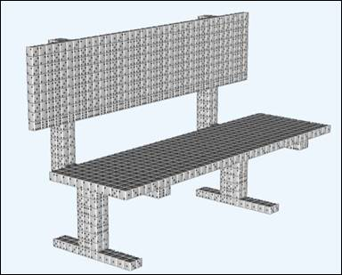

[← Pagina Inicial](../../README.md#--)

<h1 align="center">Banco de dados</h1>

## Do Caos à Luz

Imagine que você, meu caro discípulo, começa um negócio, e você precisa armazenar os dados dos seus clientes, e vem a ideia de armazenar isso em planilhas. Legal, você consegue armazenar algumas centenas, é chato de mexer mas resolve. Agora, você também faz isso para finanças, estoque, entre outros, beleza, você já tem várias planilhas que precisa gerenciar e manter.

Agora imagine que precisará compartilhar esses arquivos entre outras pessoas para editarem ao mesmo tempo... Já está imaginando a bagunça né? Vamos complicar mais... Você expandiu e abriu mais uma loja, e você precisa gerenciar ela separadamente e sem ter conflitos com as outras pessoas editando os arquivos. Você resolve colocar isso em um servidor, mas como vai gerenciar todos esses arquivos?

Bem, acho que já deu para ter uma leve visão do que era gerenciar dados e arquivos antes de termos os Bancos de Dados de hoje, não é mesmo? Completo Caos, e a Luz são os Bancos de Dados. (P.S.: podemos ter resolvido parte desses problemas, mas sempre surgem outros, não é mesmo? rs.)

## O que são Banco de dados?

**Bancos de dados** são conjuntos de arquivos estruturados de forma que são relacionados entre si por algum significado, se eles não possuem significado, não podem ser considerados uma base de dados, são só dados jogados. E isso faz sentido, como você relacionaria dados de economia brasileira com uma loja de vendas de doces na China? Esses dois conjuntos não tem uma relação que faça sentido. (ref.: [IME-USP / 2-Definição Geral](https://www.ime.usp.br/~jef/apostila.pdf))

Para resolver o problema que citei acima em [Do Caos à Luz](##-Do-Caos-à-Luz), da estruturação de sistemas de arquivos que não garantiam segurança em manter os arquivos de dados seguros, independentes, sem conflitos, entre outros problemas, os Bancos de dados foram criados, formas estruturadas e seguras que garantem (até certo ponto, claro), que seus dados se mantenham seguros e consistentes.

O objetivo geral de um banco de dados é guardar e permitir buscar dados de forma segura. Esse é o princípio dele. Não tem muito segredo. As grandes empresas precisavam manter seus dados seguros e de fácil acesso para conseguirem montar seus relatórios, verificar histórico entre outras coisas, o que agregou muito valor e agrega até hoje.

Essa possibilidade de guardar dados em um local robusto trás muitas possibilidades, que hoje permitiram muitos dos sistemas de hoje e que a internet fosse o que é hoje.

As implementações dos bancos de dados dependem dos sistemas gerenciadores deles, de como eles fazem essa implementação. Ou seja, um SGBD **NÃO É** um banco de dados, ele é o sistema que gerencia os bancos de dados. Estas questões de implementação são mais avançadas e não interessantes para quem está começando.

## Exemplos de banco de dados

Existente diversos exemplos de bancos de dados que você pode encontrar, e que você pode fazer também! Lojas, restaurantes, sistemas governamentais, indústrias, aplicativos, sites, tudo, literalmente quase todo sistema conectado na internet hoje tem um banco de dados por trás, por mais simples que ele seja.

Bancos de dados costumam refletir o ambiente que eles estão localizados, assim como as regras de negócios que os envolvem, visando salvar os dados necessários para manter a operação da organização, sistema, ou seja o que for, rodando.

No módulo de **Modelagem** falaremos um pouco melhor sobre isso, e como o ambiente para qual você vai estruturar um banco de dados influencia completamente em sua estrutura. Existem banco de dados iguais, claro que existem, mas cada um deles vai operar de uma forma dependendo do seu contexto.

Um restaurante por exemplo, seu banco de dados vai armazenar o estoque de alimentos, quais foram os pedidos feitos, qual o fluxo de caixa que está acontecendo, quais são as mesas que pediram certos pratos, quais garçons atenderam, e assim vai...

Nada impede que eles façam um banco de dados só para as finanças, outro só para seus funcionários, outro só para seu estoque, como citado, vai depender do contexto.

## Next step

Muito bem! Agora você sabe um pouco mais sobre o que é um banco de dados, vamos passar então para os sistemas que os gerenciam.

<h1 align="right">

</h1>

[← Pagina Inicial](../../README.md#--)